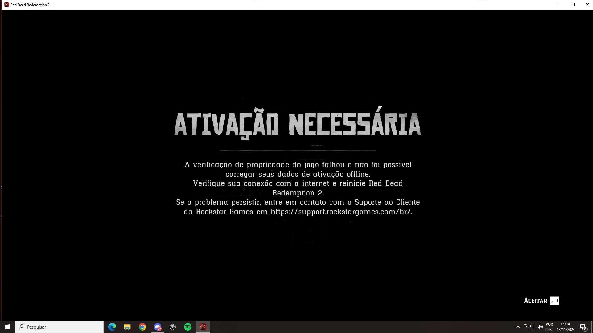

# Erro do RED DEAD REDEMPTION 2 - ATIVAÇÃO NECESSÁRIA

**Esse erro acontece pois o nome de Usuário da sua conta do Windows possui acento ou algum caractere especial, não me pergunte o porquê, mas o crack tem problemas em lidar com isso, é a forma que ele funciona**

Como resolver: 
# Vá ao [repositório do Hydra/Guides no Github](https://github.com/Ezekbrz/hydra/blob/main/guides/13.md) e siga o passo-a-passo.