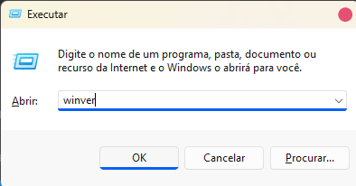
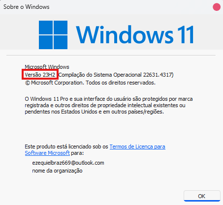

# Por que meu jogo não está abrindo? (Em casos de Windows 11, versão 24H2)

Os jogos que foram quebrados pela cracker EMPRESS, responsável pelo desbloqueio de jogos com o ANTI-TAMPER mundialmente conhecido como DENUVO, deixaram de funcionar a partir do Windows 11 24H2, há alguns métodos para fazê-los funcionar, mas varia de jogo para jogo, ficando inviável a coleta de informações sobre todos eles.

# Método para ver a versão do seu Windows:

1. Aperte a tecla Windows e digite: Executar

2. Abra o programa e digite: Winver

3. Verifique a versão do seu Windows 11 na janela que aparecer.

