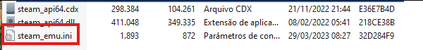
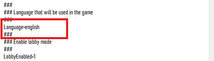
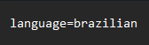

# Como alterar a língua dos games que estão em RUSSO/INGLÊS para o Português(BR)

1. Para isso, primeiro ache a pasta principal com os arquivos do seu jogo, para isso, aperte com o botão direito sobre o ícone do jogo na Área de Trabalho e aperte em "Abrir local do Arquivo"

2.  Depois de achar a pasta, procure por uma pasta com um arquivo chamado "Steam_emu", após localizá-lo, abra-o utilizando um editor de texto (Pode ser o Bloco De Notas)

3.  Encontre um texto que fala "language=XXXXX"

4.  Altere o arquivo para "language=brazilian" com apenas 1 L e com B minúsculo, exatamente da forma que está escrito

