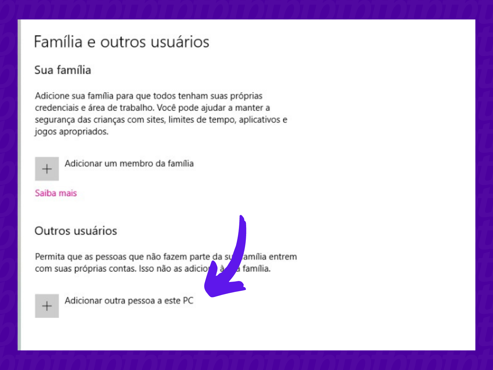

# Como criar uma conta Local no Windows para resolver erros em games no Windows 10 e Windows 11

**No Windows 10:**

1.  Abra suas configurações

Primeiramente, acesse o menu iniciar do seu computador e vá até “Configurações” para acessar a página de criação de conta local;

2.  Vá até contas

Assim que a página abrir, vá até “Contas” e clique para abrir;

3.  Adicione um perfil

Uma nova tela com algumas opções deve aparecer. Caso queira adicionar uma conta para um membro da sua família clique na primeira opção exibida na tela. Caso queira mais segurança, ou adicionar um perfil para um amigo, por exemplo, selecione a segunda opção;

4.  Informe os dados

Agora temos um porém: o Windows vai pedir para que você adicione uma Conta Microsoft para que o novo usuário seja criado. Entretanto, como queremos criar uma conta local, é preciso selecionar a opção “Não tenho as informações de entrada dessa pessoa“;

5.  Conclua

Por fim, selecione a opção “Adicionar um usuário sem uma conta da Microsoft” e informe os dados para cadastro da conta local. É preciso informar um novo nome de usuário, uma senha composta por números e letras e responder algumas perguntas de segurança que servirão como backup futuramente.

Pronto!!

**No Windows 11:**

1.  Abra suas configurações

É possível acessar via barra de tarefas ou pelo menu iniciar;

2.  Acesse a página de contas

O atalho fica posicionado na barra lateral da página de configurações;

3.  Adicione uma nova conta local

Clique em “Família e outros usuários“;

4.  Informe os dados

Assim como no Windows 10, clique em “Adicionar um usuário sem uma conta da Microsoft” e informe os dados para criação de uma conta local

5.  Conclua o processo

Finalize o processo criando uma senha de acesso.

Pronto!!