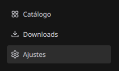
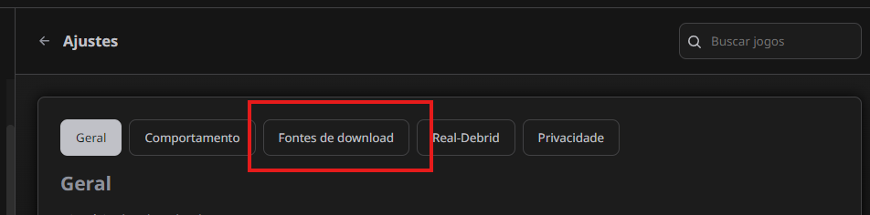
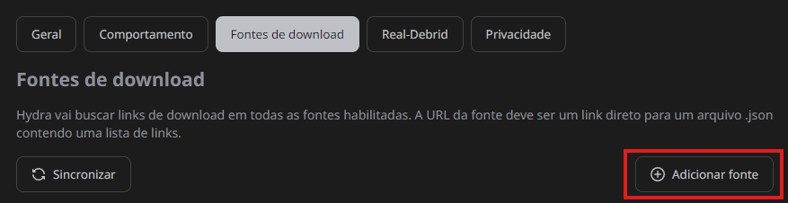
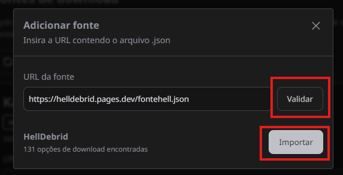

# Como adicionar a minha fonte (HellDebrid)

1.  Primeiro abra o seu Hydra e clique em Ajustes

2.  Aperte em "Fontes de Download"

3.  Aperte em "Adicionar Fonte"

4.  Cole o link da minha fonte e aperte em Validar, e após isso clique em Importar

Pronto! Após isso minha fonte estará disponivel para você baixar jogos por ela.

## Beneficios de usar a minha fonte: 

1.  Links rápidos (Gofile e PixelDrain) 
2.  Sem a chatice de ficar "baixando metadados" em Torrents sem seeds/peers
3.  Links atualizados 
4.  Aceito pedidos de jogos pelo linktree ou por marcações no servidor do Discord :D