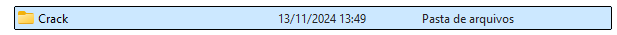
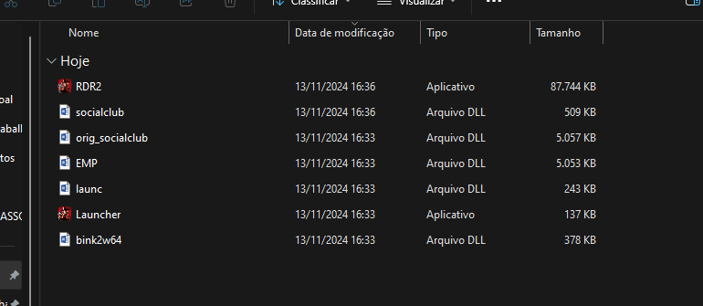

# Como resolver o erro do "SOCIAL CLUB" no RDR2

1.  Primeiro abra a pasta do seu jogo RDR2

2.  Volte uma pasta anterior a pasta do RDR2 e procure pela pasta "Crack" ou "Cracks"

3.  Abra a pasta Crack e selecione todos os arquivos que estão dentro dela

4.  Vá até a pasta do jogo e cole todos os arquivos, se pedir para substituir, substitua

Pronto! Após isso basta abrir o jogo pelo "Launcher.exe"

