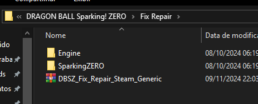
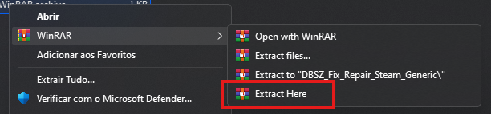
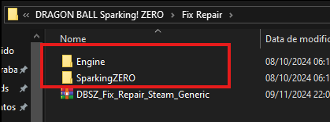
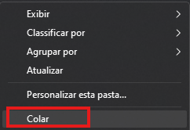

# Como reaplicar o crack de jogos ONLINEFIX quando perdidos por conta de exclusão (Anti-Vírus)?

Primeiro localize a pasta do seu jogo, geralmente uma pasta anterior a ela, ficará uma pasta chamada FIX REPAIR, abra ela.

1. Na pasta FIX REPAIR, localize o arquivo compactado de mesmo nome, extraia ele clicando com o botão direito e depois clicando em "Extrair aqui" (Utilize o WINRAR ou 7zip para isso).

2. Após extraido, copie todos os arquivos que foram gerados.

3.  Vá até a pasta do game, abra ela e cole todos os arquivos no diretório principal do game, você consegue colar os arquivos apertando Ctrl + V ou apertando com o botão direito no espaço da pasta e clicando em "Colar".

Pronto!.